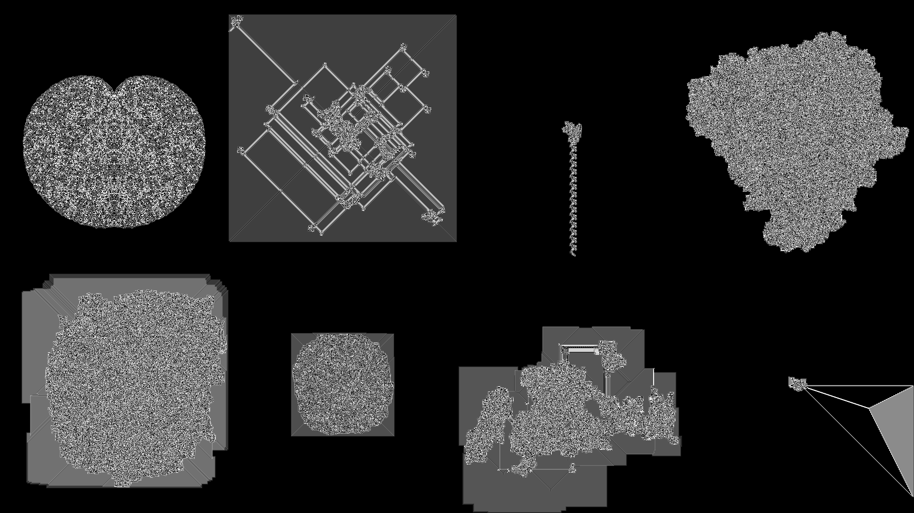

# Langton's Ant Explorer

A high-performance toolchain for finding interesting [Langton's Ant](https://en.wikipedia.org/wiki/Langton%27s_ant) outcomes.



The toolchain consists of 4 programs:
- [genstate](#genstate)
  - Generates initial states within given constraints for simulation by `simulate_many` or `simulate_one`
- [simulate_one](#simulate_one)
  - Runs a single simulation until the generation limit is reached or the ant tries to step off the grid
  - Can saves state at specific points and or an interval and or when the simulation terminates
- [simulate_many](#simulate_many)
  - Similar to `simulate_one`, but runs a batch of independent simulations in a thread pool
  - Simulations share a generation limit, save points, and save interval, but not state
- [analyze](#analyze)
  - Used to programatically find interesting states

## genstate

Used to generate states for [simulate_one](#simulate).

```txt
USAGE:
  genstate [options]

REQUIRED OPTIONS:
  -n [ --count ] arg
      number of randomized states to generate
  -p [ --outpath ] arg
      directory in which to save generated states (.json)
  -r [ --ruleslen ] arg
      [min, max] rules length, format /^[0-9]+,[0-9]+$/
  -t [ --turndirecs ] arg
      possible rule turn directions, format /^[lLnNrR]+$/, see notes for
      details
  -w [ --gridwidth ] arg
      grid_width value for all generated states, [1, 65535]
  -h [ --gridheight ] arg
      grid_height value for all generated states, [1, 65535]
  -g [ --gridstate ] arg
      grid_state for all generated states, any string
  -x [ --antcol ] arg
      ant_col value for all generated states, [0, grid_width)
  -y [ --antrow ] arg
      ant_row value for all generated states, [0, grid_height)
  -o [ --antorients ] arg
      possible ant_orientation values, format /^[nNeEsSwW]+$/, see notes for
      details

NOTES:
  For option -o [ --antorients ], the value must match /^[nNeEsSwW]+$/.
  If an orientation is repeated, it is more likely to occur.
  For example: NNNEESW means N has a 3/7 chance, E has a 2/7 chance,
  and S|W have a 1/7 chance of being randomly selected.
  The same concept applies for -t [ --turndirecs ], but the value must match /^[lLnNrR]+$/.
```

## simulate_one

Used to run simulations generated by [genstate](#genstate). Simulation states can be saved at any point as a JSON file + PGM image.

```txt
USAGE:
  simulate_one [options]

SIMULATION OPTIONS:
  -i [ --statepath ] arg
      path to initial state .json file
  -g [ --genlim ] arg
      *** generation limit, if reached the simulation will stop, > 0 uint64
  -f [ --imgfmt ] arg
      type of PGM image to produce on save, rawPGM|plainPGM, default=rawPGM
  -s [ --savefinalstate ]
      flag, if set will ensure final generation is saved regardless of any save
      points or interval
  -p [ --savepoints ] arg
      specific generations to save, JSON uint64 array
  -v [ --saveinterval ] arg
      generation interval to save at, > 0 uint64
  -o [ --savepath ] arg
      *** directory in which to save state .json and .pgm files

*** = required
```

## simulate_many

Used to run a batch of simulations generated by [genstate](#genstate). Simulation states can be saved at any point. Simulations are run in parallel using a job system to saturate all CPU cores.

```txt
USAGE:
  simulate_many <num_threads> [options]

SIMULATION OPTIONS:
  -i [ --statepath ] arg
      path to directory containing initial state .json files
  -g [ --genlim ] arg
      *** generation limit, if reached the simulation will stop, > 0 uint64
  -f [ --imgfmt ] arg
      type of PGM image to produce on save, rawPGM|plainPGM, default=rawPGM
  -s [ --savefinalstate ]
      flag, if set will ensure final generation is saved regardless of any save
      points or interval
  -p [ --savepoints ] arg
      specific generations to save, JSON uint64 array
  -v [ --saveinterval ] arg
      generation interval to save at, > 0 uint64
  -o [ --savepath ] arg
      *** directory in which to save state .json and .pgm files

*** = required
```

## analyze

Development starting soon.

## State Format

```json
{
  "generation":       /* [0, (2^64)-1]                  */,
  "last_step_result": /* "nil" | "success" | "hit_edge" */,

  "grid_width":  /* [1, 65535] */,
  "grid_height": /* [1, 65535] */,
  "grid_state":  /* "fill N" where N [0, 255] OR path to PGM */,

  "ant_orientation": /* "N" | "E" | "S" | "W" */,
  "ant_x":           /* [0, grid_width)       */,
  "ant_y":           /* [0, grid_height)      */,

  "rules": [
    {
      "on":           /* [0, 255]        */,
      "replace_with": /* [0, 255]        */,
      "turn":         /* "L" | "N" | "R" */
    },
    // ... at least 2 entries
  ]
}
```

Rules must form a closed chain. For example:

```json
// ruleset 1, valid
"rules": [
  { "on": 0, "replace_with": 1, "turn": "L" },
  { "on": 1, "replace_with": 0, "turn": "R" }
]

// ruleset 2, invalid
"rules": [
  { "on": 0, "replace_with": 1, "turn": "L" },
  { "on": 1, "replace_with": 2, "turn": "R" },
  { "on": 2, "replace_with": 2, "turn": "N" }
]

// ruleset 3, invalid
"rules": [
  { "on": 0, "replace_with": 1, "turn": "L" },
  { "on": 1, "replace_with": 0, "turn": "R" },
  { "on": 2, "replace_with": 3, "turn": "N" },
  { "on": 3, "replace_with": 0, "turn": "R" }
]
```

Visualized:


## Third Party Libraries Used

- [Boost 1.80.0](https://www.boost.org/users/history/version_1_80_0.html) program_options
- [bshoshany/thread-pool](https://github.com/bshoshany/thread-pool)
