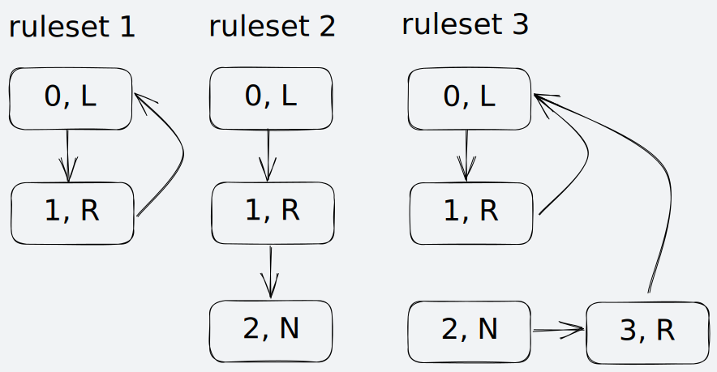

# Langton's Ant Explorer

A high-performance toolchain for finding interesting [Langton's Ant](https://en.wikipedia.org/wiki/Langton%27s_ant) outcomes.

The toolchain consists of 4 programs:
- [gencfg](#gencfg)
  - Generates initial states within given constraints for simulation by `simulate_many` or `simulate_one`
- [simulate_one](#simulate_one)
  - Runs a single simulation until the generation limit is reached or the ant tries to step off the grid
  - Can saves state at specific points and or an interval and or when the simulation terminates
- [simulate_many](#simulate_many)
  - Similar to `simulate_one`, but runs a batch of independent simulations in parallel
  - Simulations share the generation limit, save points, and save interval, but not state
- [analyze](#analyze)
  - Used to programatically find interesting states

## gencfg

Used to generate states for [simulate_one](#simulate).

| Option | Required | Value | Description |
| - | - | - | - |
| --count | Y | > 0 int | Number of configurations to generate |
| --minlen | Y | [2, 255] int | Minimum ruleset length, inclusive |
| --maxlen | Y | [2, 255] int | Maximum ruleset length, inclusive |
| --gw | Y | [1, 65535] int | Grid width |
| --gh | Y | [1, 65535] int | Grid height |
| --gs | Y | string | Grid state |
| --ac | Y | [0, --gw) int | Ant column |
| --ar | Y | [0, --gh) int | Ant row |
| --ao | N | string of any: NESW | Possible ant orientations, defaults to NESW |
| --td | N | string of any: LNR | Possible rule turn directions, defaults to LNR |
| --outdir | N | path | Directory where to emit JSON configuration files, defaults to current directory |

## simulate_one

Used to run simulations generated by [gencfg](#gencfg). Simulation states can be saved at any point as a configuration (a JSON file + PGM image). Can run a single simulation, or many in parallel using a job system to saturate all CPU cores.

| Option | Required | Value | Description |
| - | - | - | - |
| --name | Y | string | Name of the simulation |
| --cfg | Y | * | Path to configuration file, defines the initial state of the simulation |
| --maxgen | Y | uint64 | The generation limit, simulation will stop once it is reached |
| --imgfmt | N | "rawPGM" or "plainPGM" | The type of image to emit, defaults to rawPGM |
| --savefinalstate | N | flag | If specified, the final state of the simulation will be saved regardless of any save points or save interval |
| --savepoints | N | JSON unsigned array | Specific generations whose state to save |
| --saveinterval | N | uint64 | A generation interval at which to save simulation state |

## simulate_many

Used to run a batch of simulations generated by [gencfg](#gencfg). Simulation states can be saved at any point. Simulations are run in parallel using a job system to saturate all CPU cores.

## analyze

Development starting soon.

## State format

```json
{
  "generation":       /* [0, (2^64)-1]                  */,
  "last_step_result": /* "nil" | "success" | "hit_edge" */,

  "grid_width":  /* [1, 65535] */,
  "grid_height": /* [1, 65535] */,
  "grid_state":  /* "fill N" where N [0, 255] OR path to PGM */,

  "ant_orientation": /* "north" | "east" | "south" | "west" */,
  "ant_x":           /* [0, grid_width)                     */,
  "ant_y":           /* [0, grid_height)                    */,

  "rules": [
    {
      "on":           /* [0, 255]        */,
      "replace_with": /* [0, 255]        */,
      "turn":         /* "L" | "N" | "R" */
    },
    // ... at least 2 entries
  ]
}
```

### rules

Must form a closed chain.

For example:

```json
// ruleset 1, valid
"rules": [
  { "on": 0, "replace_with": 1, "turn": "L" },
  { "on": 1, "replace_with": 0, "turn": "R" }
]

// ruleset 2, invalid
"rules": [
  { "on": 0, "replace_with": 1, "turn": "L" },
  { "on": 1, "replace_with": 2, "turn": "R" },
  { "on": 2, "replace_with": 2, "turn": "N" }
]

// ruleset 3, invalid
"rules": [
  { "on": 0, "replace_with": 1, "turn": "L" },
  { "on": 1, "replace_with": 0, "turn": "R" },
  { "on": 2, "replace_with": 3, "turn": "N" },
  { "on": 3, "replace_with": 0, "turn": "R" }
]
```

Visualized:


