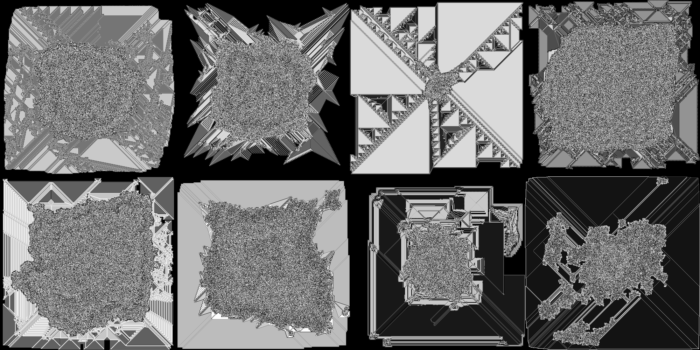

# Langton's Ant Explorer

A high-performance toolchain for discovering interesting [Langton's Ant](https://en.wikipedia.org/wiki/Langton%27s_ant) outcomes.

## Table of Contents
  - [The Toolchain](#toolchain)
  - [Building](#building)
  - [Third Party Libraries Used](#third-party-libraries-used)




[More galleries here.](galleries.md)

## Toolchain
The toolchain consists of 5 separate programs designed to work together:
- [next_cluster](#next_cluster)
  - Determines the next cluster number in a directory of clusters
- [make_states](#make_states)
  - Generates initial states for simulation
- [make_image](#make_image)
  - Creates customized PGM images for seeding initial grid states
- [simulate_one](#simulate_one)
  - Runs a single simulation until the generation limit is reached or the ant tries to step off the grid
  - Can saves state at specific points and or an interval and or when the simulation terminates
- [simulate_many](#simulate_many)
  - Similar to `simulate_one`, but runs a batch of simulations in a thread pool, intended for mass processing
  - Simulations share a generation limit, save points, and save interval, but not state

Having separate programs creates flexibility by allowing users to orchestrate them as desired. See [scripts/cluster.py](/scripts/cluster.py) for a simple example script for creating clusters of simulations.

## make_states

```text
Usage:
  make_states [options]

Options:
  -N [ --count ] arg
      Number of randomized states to generate.
  -o [ --out_dir_path ] arg
      Output directory for JSON state files.
  -c [ --create_dirs ]
      Create --out_dir_path and parent directories if not present, off by
      default.
  -w [ --grid_width ] arg
      Value of 'grid_width' for all generated states, [1, 65535].
  -h [ --grid_height ] arg
      Value of 'grid_height' for all generated states, [1, 65535].
  -x [ --ant_col ] arg
      Value of 'ant_col' for all generated states, [0, grid_width).
  -y [ --ant_row ] arg
      Value of 'ant_row' for all generated states, [0, grid_height).
  -m [ --min_num_rules ] arg
      Minimum number of rules for generated states, inclusive, default=2.
  -M [ --max_num_rules ] arg
      Maximum number of rules for generated states, inclusive, default=256.
  -g [ --grid_state ] arg
      Value of 'grid_state' for all generated states, any string,
      default='fill=0'.
  -s [ --shade_order ] arg
      Ordering of rule shades, asc|desc|rand, default=asc
  -n [ --name_mode ] arg
      The method used for naming generated JSON state files,
      /^(turndirecs)|(randwords,[1-9])|(alpha,[1-9])$/. 'alpha,N' will generate
      a string of N random letters, e.g. 'aHCgt'. 'turndirecs' will use the
      chain of turn directions, e.g. 'LRLN'. 'randword,N' will use N random
      words from --word_file_path separated by underscores, e.g. 'w1_w2_w3'.
  -W [ --word_file_path ] arg
      Path of file whose content starts with a newline, followed by
      newline-separated words, and ends with a newline, e.g. '\nW1\nW2\n'. Only
      necessary when --name_mode is 'randwords,N'.
  -t [ --turn_directions ] arg
      Possible rule 'turn_dir' values, /^[lLnNrR]+$/, default=LR. Values are
      chosen randomly from this list, so having repeat values makes them more
      likely to occur. For instance, 'LLLRRN' results in a 3/6 chance for L,
      2/6 chance for R, and 1/6 chance for N.
  -O [ --ant_orientations ] arg
      Possible 'ant_orientation' values, /^[nNeEsSwW]+$/, default=NESW. Values
      are chosen randomly from this list, so having repeat values makes them
      more likely to occur. For instance, 'NNNEES' results in a 3/6 chance for
      N, 2/6 chance for E, 1/6 chance for S, and 0/6 chance for W.
```

## make_image

```text
Usage:
  make_image [options]

Options:
  -o [ --out_file_path ] arg
      Output PGM file path.
  -f [ --format ] arg
      PGM image format, raw|plain.
  -c [ --content ] arg
      Type of image content, /^(noise)|(fill=[0-9]{1,3})$/.
  -w [ --width ] arg
      Image width, [1, 65535].
  -h [ --height ] arg
      Image height, [1, 65535].
  -m [ --maxval ] arg
      Maximum pixel value, [1, 255].
```

## simulate_one

```text
Usage:
  simulate_one [options]

General options:
  -N [ --name ] arg
      Name of simulation, if unspecified state_file_path filename is used.
  -S [ --state_file_path ] arg
      JSON file containing initial state.
  -L [ --log_file_path ] arg
      Log file path.

Simulation options:
  -g [ --generation_limit ] arg
      Generation limit, if reached the simulation will stop, 0 means max
      uint64.
  -f [ --image_format ] arg
      PGM image format for saves, raw|plain.
  -l [ --create_logs ]
      Create a log entry when a save is made.
  -o [ --save_path ] arg
      Directory in which to save state JSON and PGM files.
  -y [ --save_image_only ]
      Do not emit JSON files when saving state.
  -s [ --save_final_state ]
      Ensures final state is saved regardless of save points or interval.
  -p [ --save_points ] arg
      Specific generations (points) to save.
  -v [ --save_interval ] arg
      Generation interval at which to save.
```

## simulate_many

```text
Usage:
  simulate_many [options]

General options:
  -T [ --num_threads ] arg
      Number of threads in thread pool.
  -Q [ --queue_size ] arg
      Number of simulations per processing chunk.
  -S [ --state_dir_path ] arg
      Path to directory containing initial JSON state files.
  -L [ --log_file_path ] arg
      Log file path.
  -C [ --log_to_stdout ]
      Log to standard output.

Simulation options:
  -g [ --generation_limit ] arg
      Generation limit, if reached the simulation will stop, 0 means max
      uint64.
  -f [ --image_format ] arg
      PGM image format for saves, raw|plain.
  -l [ --create_logs ]
      Create a log entry when a save is made.
  -o [ --save_path ] arg
      Directory in which to save state JSON and PGM files.
  -y [ --save_image_only ]
      Do not emit JSON files when saving state.
  -s [ --save_final_state ]
      Ensures final state is saved regardless of save points or interval.
  -p [ --save_points ] arg
      Specific generations (points) to save.
  -v [ --save_interval ] arg
      Generation interval at which to save.

Additional Notes:
  - Each queue slot requires 624 bytes for the duration of the program
  - Each in-flight simulation (# determined by thread pool size) requires 624 bytes of storage
     plus whatever the grid (image) requires, where each cell (pixel) occupies 1 byte
  - Each simulation requires 48 bytes of storage for the duration of the program
```

## State Format

```json
{
  "generation":       /* [0, (2^64)-1]                  */,
  "last_step_result": /* "nil" | "success" | "hit_edge" */,

  "grid_width":  /* [1, 65535] */,
  "grid_height": /* [1, 65535] */,
  "grid_state":  /* "fill N" where N [0, 255] OR path to PGM */,

  "ant_orientation": /* "N" | "E" | "S" | "W" */,
  "ant_col":         /* [0, grid_width)       */,
  "ant_row":         /* [0, grid_height)      */,

  "rules": [
    {
      "on":           /* [0, 255]        */,
      "replace_with": /* [0, 255]        */,
      "turn":         /* "L" | "N" | "R" */
    },
    // ... at least 2 entries
  ]
}
```

Rules must form a closed chain. For example:

```json
// ruleset 1, valid
"rules": [
  { "on": 0, "replace_with": 1, "turn": "L" },
  { "on": 1, "replace_with": 0, "turn": "R" }
]

// ruleset 2, invalid
"rules": [
  { "on": 0, "replace_with": 1, "turn": "L" },
  { "on": 1, "replace_with": 2, "turn": "R" },
  { "on": 2, "replace_with": 2, "turn": "N" }
]

// ruleset 3, invalid
"rules": [
  { "on": 0, "replace_with": 1, "turn": "L" },
  { "on": 1, "replace_with": 0, "turn": "R" },
  { "on": 2, "replace_with": 3, "turn": "N" },
  { "on": 3, "replace_with": 0, "turn": "R" }
]
```

Visualized:


## Building

For now the primary supported platform is Linux. As such, only Linux has a build system included. This project uses make.

To build the toolchain in release (optimized) mode, run:

```shell
make -j $(nproc)
```

To build a specific program from the toolchain, run one of:

```shell
make -j $(nproc) next_cluster
make -j $(nproc) make_states
make -j $(nproc) make_image
make -j $(nproc) simulate_one
make -j $(nproc) simulate_many
```

To build the toolchain in debug mode, use `BUILD_TYPE=debug`:

```shell
# The whole toolchain:
make -j $(nproc) BUILD_TYPE=debug

# A specific program from the toolchain:
make -j $(nproc) BUILD_TYPE=debug next_cluster
make -j $(nproc) BUILD_TYPE=debug make_states
make -j $(nproc) BUILD_TYPE=debug make_image
make -j $(nproc) BUILD_TYPE=debug simulate_one
make -j $(nproc) BUILD_TYPE=debug simulate_many
```

To build and run the testing suite in debug mode (recommended), run:

```shell
make -j $(nproc) BUILD_TYPE=debug tests && bin/debug/tests
```

To build and run the testing suite in release mode, run:

```shell
make -j $(nproc) tests && bin/release/tests
```

And the usual cleaning process:

```shell
make clean
```

## Third Party Libraries Used

- [Boost 1.80.0](https://www.boost.org/users/history/version_1_80_0.html) (modules: program_options, container)
- [bshoshany/thread-pool](https://github.com/bshoshany/thread-pool)
- [nlohmann/json](https://github.com/nlohmann/json)
